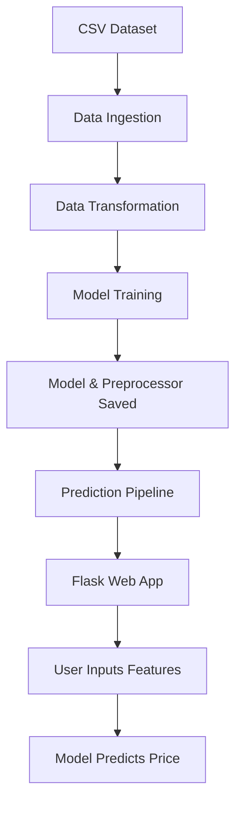

# 📈 Diamond Price Prediction

A complete end-to-end machine learning project to predict the price of diamonds using various regression algorithms and deploy it using a Flask web app.

---

## 🔄 Project Workflow



---

## 📁 Project Structure

```
DiamondPricePrediction/
|
├── src/
│   ├── components/
│   │   ├── data_ingestion.py        # Load & split raw data
│   │   ├── data_transformation.py   # Feature engineering & pipeline
│   │   └── model_trainer.py         # Train & evaluate ML models
│   ├── pipelines/
│   │   ├── training_pipeline.py     # End-to-end training flow
│   │   └── prediction_pipeline.py   # Serve predictions
│   ├── utils.py                     # Utility functions
│   ├── logger.py                    # Logging config
│   └── exception.py                 # Custom exception class
|
├── artifacts/                      # Stores data and trained models
│   ├── train.csv
│   ├── test.csv
│   ├── model.pkl
│   └── preprocessor.pkl
|
├── templates/                      # HTML UI templates
│   ├── form.html
│   └── index.html
|
├── static/                         # Static assets like images
│   └── diamond.png
|
├── app.py                          # Flask application
├── requirements.txt                # Python dependencies
└── README.md
```

---

## 🔢 Model Pipeline Summary

### Step 1: Data Ingestion

- Reads raw diamond CSV data
- Splits into train/test
- Saves to `artifacts/`

### Step 2: Data Transformation

- Handles missing values
- Encodes categorical features (Cut, Color, Clarity)
- Scales numerical features
- Combines via `ColumnTransformer`
- Saves as `preprocessor.pkl`

### Step 3: Model Training

- Trains multiple regressors: Linear, Ridge, Lasso, RandomForest, XGBoost
- Evaluates with R² score
- Saves best model as `model.pkl`

### Step 4: Prediction Pipeline

- Loads `model.pkl` and `preprocessor.pkl`
- Transforms new input
- Returns predicted price

### Step 5: Flask Web App

- User submits diamond features via `form.html`
- Backend predicts price
- Result is displayed on the same page

---

## 🌟 Technologies Used

- Python 3.10+
- Pandas, NumPy
- Scikit-learn
- XGBoost
- Flask
- HTML/CSS (Jinja2 templates)


